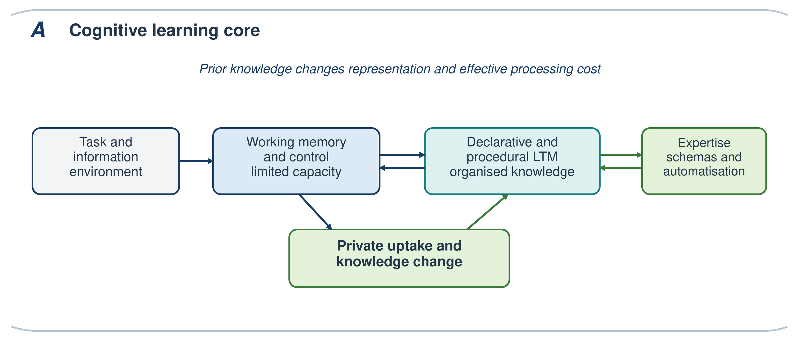
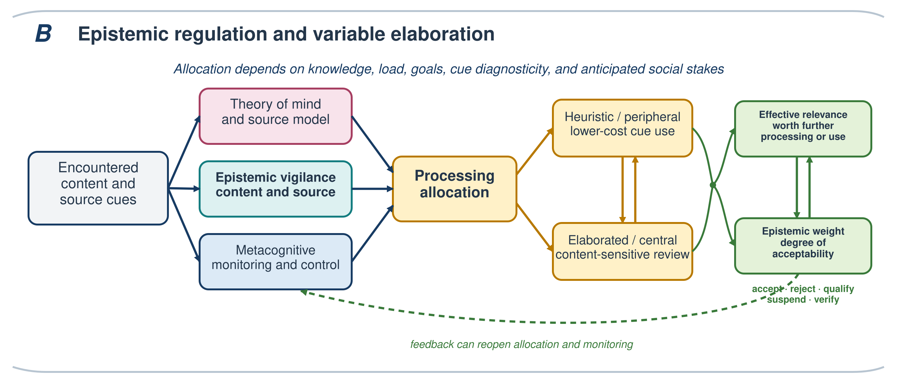
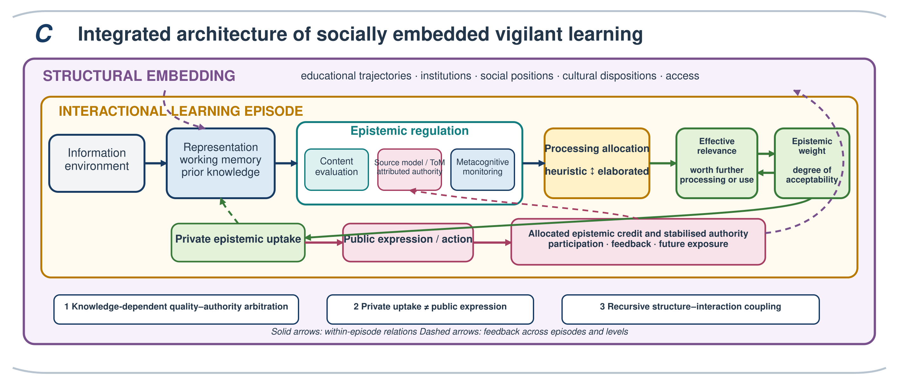

MOVICI Research Programme

Working paper · 2026 · Preprint — not peer reviewed

Resources
<a class="resource-link" href="files/MOVICI_WP01.pdf">Download PDF</a>
Theoretical paper — no empirical dataset

## Video Presentation

<iframe src="https://www.youtube.com/embed/Bo5vOOph4H4" title="MOVICI Working Paper 01 video presentation" allow="accelerometer; autoplay; clipboard-write; encrypted-media; gyroscope; picture-in-picture; web-share" allowfullscreen></iframe>

## Abstract

::: {.abstract-block}
Learning from testimony, instruction, documents, and digital systems requires more than comprehension and memory. Learners must decide which claims warrant acceptance, which sources merit trust, and how limited cognitive resources should be allocated. Yet learning theories often give limited attention to social provenance, whereas social accounts of authority rarely specify the memory and control mechanisms through which social conditions alter learning. This article introduces CAVL, the Cognitive Architecture for Vigilant Learning, as a functional, multilevel architecture of socially embedded vigilant learning. CAVL links working memory, declarative and procedural long-term memory, schema construction, and automatisation with epistemic vigilance, theory of mind, metacognitive regulation, and two forms of social embedding. Structural embedding concerns how trajectories, institutions, and social positions shape knowledge, dispositions, cues, and verification costs. Interactional embedding concerns the evaluation of contents and sources when direct verification is limited. CAVL makes three signature claims. Learners arbitrate between content quality and attributed epistemic authority as a function of valid prior knowledge, processing constraints, and cue diagnosticity. Private epistemic uptake can diverge from public expression when communicating a judgement carries social or reputational costs. Structurally distributed resources and interactionally allocated authority recursively shape exposure, participation, and later learning. Six falsifiable propositions specify when these claims would be supported or require revision. CAVL is not a theory of all learning. It is a middle-level architecture for explaining how socially available information is evaluated, weighted, integrated, and expressed.
:::

**Keywords:** socially embedded learning; epistemic vigilance; expertise; cognitive architecture; epistemic authority; metacognition

## 1 The theoretical problem of socially embedded vigilant learning

Human learning is radically dependent on others. Instruction, testimony, books, institutions, search engines, and conversational systems make knowledge available that no learner could reconstruct independently. The same dependence creates vulnerability. Communicated information can be mistaken, strategically distorted, socially rewarded despite its weakness, or accurate yet costly to acknowledge. Learning from communication therefore requires calibrated openness: enough receptivity to benefit from others and enough vigilance to avoid granting epistemic weight indiscriminately (Sperber et al., 2010; Mercier, 2020).

This problem exposes a more general theoretical fragmentation. Newell (1973) argued that psychology could not progress indefinitely by accumulating answers to narrowly framed experimental questions without constructing systems able to coordinate them. His later call for unified theories of cognition sought architectures in which memory, problem solving, learning, and control constrained one another across tasks (Newell, 1990). The concern remains pertinent. Experimental literatures can establish local causal effects while leaving unclear how those effects combine in culturally and socially complex learning situations. This is visible in misinformation research, where findings about source labels, repetition, accuracy prompts, prior beliefs, or corrections often concern sharply delimited mechanisms. It is also visible in expertise research and Cognitive Load Theory, which offer powerful accounts of knowledge-dependent processing but usually represent the social origin and distribution of knowledge only indirectly.

The inverse fragmentation appears in social sciences. Sociology and social psychology explain how status, institutions, socialisation, collective identities, and inequalities organise belief and authority. Cognitive sociology has long argued that socially organised classifications and interpretive practices shape what becomes cognitively available (Cicourel, 1974; DiMaggio, 1997). Bourdieu's concept of habitus similarly describes durable and transposable dispositions produced through conditions of existence and trajectories of practice, rather than a momentary variable located inside a task (Bourdieu, 1990). These traditions make the social production of cognition visible. They do not always specify which cognitive mechanisms preserve relative autonomy, how prior knowledge changes online evaluation, or why the same social cue affects novices and experts differently. Situated and bounded accounts further show that cognition is adapted to the structure of tasks and environments rather than optimised in the abstract (Simon, 1955, 1956; Hutchins, 1995).

The problem is not that controlled experiments are unreal or that social explanations lack cognitive content. A laboratory effect can be causally valid within its design while failing to transport unchanged to a learning situation containing heterogeneous knowledge, competing goals, reputational stakes, and unequal opportunities. Conversely, a structural regularity can be real without determining every judgement directly. The theoretical task is to explain how levels constrain one another without reducing one to the other. Generalisable behavioural science requires such theoretically specified cross-level relations, not merely broader samples or longer lists of moderators (Anderson & Lebiere, 2003; Muthukrishna & Henrich, 2019).

CAVL addresses this task for a delimited object: *socially embedded vigilant learning*. This includes learning from teachers and peers, testimony and discussion, search and multiple documents, digital platforms, and knowledge transmitted through institutions. Work on source monitoring, sourcing, and document models shows why content must remain connected to its provenance (Johnson et al., 1993; Perfetti et al., 1999; Bråten et al., 2011; Anmarkrud et al., 2022). CAVL does not attempt to explain all perceptual, motor, associative, or reinforcement learning. Its question is narrower: through what interacting cognitive and social operations does communicated information acquire sufficient effective relevance and epistemic weight to guide judgement and modify knowledge?

These mechanisms operate in ordinary educational situations. A student comparing conflicting documents must connect claims with their provenance. A novice may depend on a teacher or peer because the knowledge required to evaluate an explanation is not yet available. A learner using a generative system may understand a fluent answer while remaining unable to verify its sources or uncertainty. CAVL treats these situations as variations of the same architectural problem: learners must allocate effort, evaluate contents and attributed authority, and decide what to retain, endorse, express, or verify.

The proposed answer begins with a robust cognitive core. Anderson's architecture distinguishes declarative knowledge from procedural productions and explains how practice changes retrieval and control (Anderson, 1996; Anderson & Lebiere, 2003). Sweller's Cognitive Load Theory explains learning through the relation between severely limited working memory and organised schemas in long-term memory (Sweller, 1988; Sweller et al., 2011). Expertise develops as elements are organised into retrievable schemas, chunks, and procedures, thereby changing the effective demands of a task (Chase & Simon, 1973; Ericsson & Kintsch, 1995). These traditions explain how knowledge makes further learning possible. By themselves, however, they say relatively little about why a learner grants a socially supplied claim access to those learning processes.

Epistemic vigilance supplies the missing interface. Sperber and colleagues describe a family of mechanisms that evaluate communicated contents and informants by drawing on plausibility, arguments, competence, benevolence, and reputation (Sperber et al., 2010; Mercier & Sperber, 2017). Their account is mechanistic and programmatic, but it is not a complete cognitive architecture of learning. CAVL therefore does not append "the social" as an external contextual box. It integrates epistemic vigilance, theory of mind, source memory, metacognition, and social goals with the memory architecture that supports expertise and knowledge change.

This integration rests on *double social embedding*. Structural embedding concerns the production of the learner's resources: domain knowledge, epistemic dispositions, language practices, familiarity with institutions, and the material cost of verification develop through unequal educational and social trajectories. Interactional embedding concerns a more proximal dependency. When learners lack the expertise needed to evaluate content directly, they rely more heavily on representations of who knows what, source cues, arguments, and socially attributed authority. Actual competence and recognised authority may align, but they can also diverge. The two levels form a feedback loop: structures shape the cues and resources available during interaction; repeated allocations of credibility and attention reproduce or transform structures of epistemic authority.

CAVL's distinctive contribution lies in three signature claims that emerge from coupling these literatures. First, arbitration between content quality and attributed epistemic authority is knowledge-dependent. When valid prior knowledge and usable evidence permit direct evaluation, content quality should receive greater weight. When they do not, attributed authority should become more influential. Second, private epistemic uptake and public expression can dissociate because social and reputational costs may affect expression even when private evaluation remains unchanged. Third, structural resources and interactional authority are recursively coupled. Educational and social trajectories shape knowledge, cues, dispositions, and verification costs; repeated allocations of epistemic credit then reshape participation, feedback, and opportunities for later learning. Their joint specification within a single architecture defines CAVL's distinctive contribution. Together, they form its explanatory core and motivate the tests developed in Section 8.

The educational implication is not that learners should deliberate continually or become independent of testimony. The mechanisms governing epistemic dependence should instead become sufficiently accessible to regulation when accuracy, uncertainty, or social stakes require it. Effective automatisms should be preserved and trained, while social costs should be recognised rather than confused with evidence. CAVL therefore defines epistemic autonomy as regulated dependence.

The argument proceeds progressively. Section 2 defines the explanatory status and scope of CAVL and distinguishes it from adjacent theories. Sections 3 through 6 develop its cognitive core, epistemic regulation, and interactional and structural embedding. Section 7 integrates these components into a recurrent process model and specifies conceptual constraints on relevance, epistemic weight, private uptake, and public expression. Section 8 states testable propositions and revision criteria. Sections 9 and 10 examine educational, technological, and institutional implications before clarifying the framework's limits and research agenda.

## 2 What kind of architecture is CAVL

### 2.1 A functional multilevel and precomputational architecture

Cognitive architectures identify relatively stable functions and relations that constrain performance across tasks (Newell, 1990; Kotseruba & Tsotsos, 2020). The strongest architecture also specifies representations, algorithms, and executable models. CAVL does not yet meet that computational standard. It is a *functional, integrative, multilevel, and precomputational architecture*. It identifies components, information flows, feedback relations, moderators, and boundary conditions that a later formal model must implement. Calling it an architecture is warranted only insofar as these commitments rule out explanations and generate tests.

Terminological discipline is therefore important. A *system* refers to a functionally distinguishable organization such as declarative memory, procedural memory, theory of mind, metacognitive monitoring, or valuation and control. A *mechanism* refers to an operation such as retrieval, source attribution, coherence checking, trust attribution, encoding, or updating. A *processing regime* describes the degree and form of elaboration through which those systems operate. *Epistemic weight* is the graded confidence or acceptability assigned to a representation. *Attributed epistemic authority* is a social representation of who deserves credit or deference; it is not identical to actual competence. *Embedding* refers to the interactional and structural conditions that shape processing. *Module* denotes relative functional specialization within distributed and plastic neural networks, not an encapsulated organ or a unique brain region.

CAVL is compatible with explicit symbolic representations and learned subsymbolic quantities, but it should not be described as a complete hybrid architecture. Newell and Simon established a symbolic architectural tradition. Anderson's ACT-R programme provides a stronger precedent for relating symbolic productions and declarative chunks to subsymbolic activation, utility, and neural constraints (Anderson & Lebiere, 2003). CAVL inherits the ambition to articulate levels while remaining agnostic about the precise computational format of several components.

### 2.2 Integration by explanatory transition

CAVL is a problem-driven synthesis rather than a systematic review. A construct enters the architecture when it explains a necessary transition in vigilant learning, constrains that transition, or prevents the conflation of distinguishable outcomes. Integration follows three rules. First, constructs remain separate when their causes or consequences can dissociate. Exposure, memory, private uptake, and public expression are therefore not interchangeable. Second, cross-level relations must specify a pathway. Social position cannot be treated as a momentary cognitive operation; its proximal effects must be mediated by resources, cues, goals, or opportunities unless a direct pathway is demonstrated. Third, biological evidence constrains but does not replace functional explanation.

These rules answer Newell's challenge without claiming a universal theory. CAVL is a middle-level architecture. It seeks enough integration to explain recurrent relations across socially situated learning tasks, while leaving detailed models of reading, argumentation, metacognition, persuasion, cultural transmission, and institutional power in place. Its value lies in specifying their interfaces and producing propositions that can drive cumulative theory development (Greene, 2022).

### 2.3 Relation to adjacent theories

Table 1

Adjacent theories and the explanatory niche of CAVL

  --------------------------------------------------------------------------------------------------------------------------------------------------------------------------------------------------------------------------------------------------------------------------------------------------------------------------------------
  **Tradition or model**                                      **Primary explanatory object**                                                 **Contribution retained by CAVL**                                                **Relation that CAVL adds**
  ----------------------------------------------------------- ------------------------------------------------------------------------------ -------------------------------------------------------------------------------- ----------------------------------------------------------------------------------------------------------
  ACT-R and unified cognitive architectures                   Stable cognitive components and learning mechanisms                            Declarative and procedural knowledge, retrieval, productions, control            Socially attributed sources and epistemic weighting within learning

  Cognitive Load Theory and expertise research                Learning under limited processing capacity                                     Working-memory limits, schema construction, automatisation, expertise reversal   How knowledge and load alter content evaluation, source dependence, and uptake

  Epistemic vigilance and testimony                           Protection from unreliable communication                                       Content and source evaluation, competence, benevolence, argumentation            Coupling to memory, metacognition, processing regimes, and knowledge updating

  ELM, heuristic-systematic, and dual-process accounts        Variation in elaboration and persuasion                                        Differential reliance on arguments and peripheral or heuristic cues              Recurrent route selection constrained by expertise, load, relevance, and social cost

  Sourcing and multiple-document comprehension                Source-content representation across documents                                 Provenance, corroboration, source memory, document models                        Generalisation across social learning situations and explicit distinction between weighting and uptake

  AIR, Apt-AIR, and SEGL                                      Epistemic aims, ideals, performance, and growth                                Normative criteria, epistemic resources, intervention targets                    Within-episode mechanisms through which resources change allocation, evaluation, and memory

  Cognitive sociology and social epistemology                 Social production of classifications, credibility, and authority               Institutions, trajectories, habitus, status, injustice                           Pathways from structural conditions to proximal processing and back to authority distributions

  Sociocultural, situated, and participation-based theories   Learning through culturally organised activity, mediation, and participation   Historically constituted practices, tools, institutions, and communities         Within-episode allocation, source and content evaluation, epistemic weighting, and differentiated uptake
  --------------------------------------------------------------------------------------------------------------------------------------------------------------------------------------------------------------------------------------------------------------------------------------------------------------------------------------

CAVL is also complementary to sociocultural, situated, and participation-based theories of learning. These traditions explain how participation, mediation, cultural practices, and historically constituted tools and institutions organize learning (Lave & Wenger, 1991; Rogoff, 1990; Vygotsky, 1978). CAVL operates at a different explanatory grain. It specifies how attention is allocated, how contents and sources are evaluated, how epistemic weight is assigned, and how different forms of uptake emerge within an episode. It relies on sociocultural theories to explain how the resources entering that episode was historically produced. Recent work on multiple-source use similarly shows why source evaluation must be situated within sociocultural relations and epistemic justice (Knight et al., 2026).

CAVL is especially complementary to models of epistemic cognition and growth. AIR and Apt-AIR clarify epistemic aims, ideals, reliable processes, and apt performance (Chinn et al., 2011; Barzilai & Chinn, 2018). The Stimulating Epistemic Growth in Learners model organizes epistemic virtues, beliefs, values, emotions, aims, and metacognitive resources within state--trait dynamics and identifies educational leverage points (Orona & Greene, 2026). CAVL asks a different question: how do such resources alter attention, evaluation, confidence, effort, and knowledge updating during a socially situated learning episode? SEGL can explain the development of a disposition to seek justification; CAVL specifies when that disposition can recruit diagnostic knowledge, whether verification is affordable, and how the result receives epistemic weight. Neither model supersedes the other.

Figure 1 develops CAVL progressively at the points where each layer has been introduced. Figure 1A presents the cognitive learning core. Figure 1B shows how theory of mind and source representation, epistemic vigilance, and metacognition jointly contribute to processing allocation across two variable regimes. Figure 1C presents the complete recurrent architecture within its interactional and structural embedding. The progression is pedagogical, not temporal: the completed architecture has no obligatory first module or fixed linear route.

## 3 The cognitive learning core

### 3.1 Declarative and procedural long-term memory

Vigilant learning depends first on what the learner already knows. Declarative memory supplies semantic knowledge about domains, concepts, causal relations, social roles, institutions, and typical intentions, together with episodic records of encounters, sources, and outcomes (Squire, 2004; Binder & Desai, 2011). Procedural memory supports production, habits, scripts, search routines, and increasingly automatized ways of evaluating information. These systems are analytically distinct but cooperate in skilled activity.

Prior knowledge determines which representation a learner can construct from the same message. It enables comprehension, activates expectations, supports comparison with evidence, and makes contradictions detectable. Expertise is more than an accumulation of facts: it is an organization of schemas and procedures that changes perception, retrieval, and problem solving (Chi et al., 1988; Ericsson & Kintsch, 1995). Because organized knowledge allows multiple elements to function as a meaningful unit, expertise changes effective processing cost rather than simply enlarging a fixed working-memory capacity.

This priority of knowledge creates a cumulative dynamic. Those who already possess relevant schemas can learn more efficiently and can evaluate content more directly. Yet expertise is itself socially produced through instruction, practice, access to resources, and recognition. CAVL therefore treats domain knowledge as a central proximal resource in many tasks and as an outcome of structural trajectories. This dual status is the first bridge between cognitive learning theory and social embedding.

Prior knowledge is not a truth criterion. Incorrect or identity-protective schemas can make weak claims coherent and strong counterevidence costly to integrate. Expertise can also produce entrenchment, premature closure, and overconfidence when a familiar solution blocks a better one (Bilalić et al., 2008). CAVL consequently predicts advantages from *valid and accessible* domain knowledge, not from subjective familiarity or social labels of expertise.

### 3.2 Working memory as a constrained coordination space

Working memory maintains and manipulates currently relevant representations under severe capacity limits (Baddeley, 2000; Cowan, 2001). During vigilant learning, it can coordinate the message, task goal, retrieved domain knowledge, source information, alternative interpretations, and reasons for acceptance or rejection. Executive control maintains goals, inhibits an initially attractive response, updates active representations, and changes strategy (Miller & Cohen, 2001; Miyake et al., 2000; Miyake & Friedman, 2012). These functions depend on distributed frontoparietal and content-specific networks rather than a single anatomical store (D'Esposito & Postle, 2015; Petersen & Posner, 2012).

The central constraint is competition. Comprehending a difficult claim, reconstructing an argument, recalling source history, inferring an interlocutor's intention, and anticipating the social consequences of disagreement can draw on overlapping resources. A learner may therefore understand content without comparing sources, remember a source without evaluating its argument, or form a plausible judgement without retaining the evidence that supported it. These are architectural consequences, not necessarily deficits of motivation or character.

Cognitive Load Theory explains why instruction must manage this competition. If essential elements cannot be coordinated, elaborated evaluation will fail even when the learner values accuracy. Conversely, well-organized knowledge and automatized procedures can make sophisticated evaluation fast and inexpensive. The relation between effort and epistemic quality is therefore conditional. More elaboration improves evaluation only when diagnostic knowledge and usable evidence are available; more effort in their absence can produce confusion, rationalization, or perseveration.

### 3.3 Learning as schema construction proceduralizing and feedback

Learning modifies the architecture that produced it. Accepted or conditionally retained information can update semantic schemas, create episodic traces, strengthen source-content links, or establish procedures for future tasks. Practice can transform deliberative steps into productions and heuristics. Feedback can revise both content knowledge and the estimated reliability of a source. A knowledge state at time *t + 1* therefore changes what will be attended to, understood, and trusted at time *t + 2*.

This recurrent structure is central to CAVL. Vigilance is not only a gate before memory. It can operate before focal attention through learned cue sensitivity, during comprehension through coherence monitoring, during controlled evaluation, after encoding through source monitoring, and later through retrieval, correction, or belief revision. The order of these operations depends on task, context, expertise, cognitive availability, goals, and mental state. This flexibility is constrained by predictions developed below; it is not a license to explain any sequence after the fact.

### 3.4 Developmental asymmetry

Children display early sensitivity to informant accuracy, competence, and deceptive intention (Clément et al., 2004; Mascaro & Sperber, 2009; Harris et al., 2018). Such capacities make vigilant social learning possible. They do not supply criteria for evaluating a statistical inference, a medical study, or an algorithmic recommendation. Culturally secondary knowledge requires extended instruction and practice, whereas some social sensitivities develop through ordinary interaction (Geary, 2008; Tricot & Sweller, 2014).

Education must therefore do more than invite a generic critical stance. It must build domain knowledge, source concepts, procedures, and institutional understanding that make vigilance diagnostic. Even early sensitivity to informant accuracy and deception becomes educationally powerful only when coordinated with culturally acquired criteria (Clément, 2010; Clément et al., 2004; Harris et al., 2018). A prompt to "check the source" can increase extraneous demand when a novice does not know what constitutes relevant competence or independent evidence.

{width="6.25in" height="2.6735247156605424in"}

Figure 1A. Cognitive learning core. Working memory coordinates currently active representations with declarative and procedural long-term memory. Private uptake produces knowledge change; knowledge organization and automatization create expertise that alters later representation and effective processing cost.

## 4 Epistemic regulations within the learning architecture

### 4.1 Theory of mind social knowledge and source representation

Theory of mind supports representations of what other agents know, believe, intend, and can access. In CAVL, it is neither synonymous with epistemic vigilance nor an isolated innate module. It is a constrained social-inference system whose performance draws on early-developing sensitivities and experience-dependent knowledge about agents, roles, institutions, and interactions (Premack & Woodruff, 1978; Frith & Frith, 2003).

Its relation to memory can be specified. Semantic memory contains general knowledge about roles, norms, institutions, intentions, and the distribution of expertise. Episodic memory retains encounters with particular people and sources, including earlier accuracy, deception, cooperation, and conflict. Source attribution is nevertheless reconstructive and can dissociate from memory for content (Johnson & Raye, 1981; Johnson et al., 1993). Procedural memory supports scripts and heuristics for interpreting confidence, affiliation, disagreement, credentials, and communicative behaviors. Working memory coordinates these representations with the current content. A learner deciding whether to trust an explanation may therefore retrieve what this kind of professional generally knows, remember what this person previously said, and apply a learned procedure for checking incentives.

This coordination creates a potential *double task*. The learner must represent the factual object and the social situation at the same time. In a debate, classroom disagreement, or public online exchange, processing may include the claim, the interlocutor's perspective, status relations, likely audience reactions, and the reputational cost of conceding. Under high load or low expertise, social regulation can compete with factual learning. Dominance, confidence, fluency, or coalition cues may then become more influential than truth-diagnostic evidence. The claim is conditional: debate does not inherently prevent learning, and social cognition can also direct attention toward relevant competence and cooperative intentions.

Neurocognitive evidence is consistent with a distributed mentalizing system involving medial prefrontal cortex, temporoparietal junction, posterior superior temporal sulcus, precuneus, and temporal poles, with recruitment varying by task (Schurz et al., 2014). CAVL predicts that source evaluations requiring inference about knowledge, access, or intention will draw more strongly on these systems than evaluations based on a simple learned label. It does not predict a unique "trust centre."

### 4.2 Epistemic vigilance as coordinated content and source evaluation

Epistemic vigilance is a family of mechanisms that protects the benefits of communication without making general distrust adaptive (Sperber et al., 2010). Content evaluation compares a claim with prior knowledge, evidence, coherence, alternative explanations, and argument quality. Source evaluation represents relevant competence, access to evidence, benevolence, honesty, independence, reputation, and track record. Arguments connect the two: a source can supply reasons that the learner can partly evaluate even when the conclusion exceeds current expertise.

The routes are reciprocal. Plausible, well-supported information can improve an unfamiliar source's reputation. A reliable source can justify provisional acceptance when direct content evaluation is impossible. Conflict can trigger search, qualification, reduced confidence, or suspension. It can also be resolved too quickly in favor of an identity-congruent source or a familiar claim. The outcome depends on the learner's knowledge, processing resources, aims, and cue environment.

CAVL departs from the idea of epistemic vigilance as a single filter positioned between perception and memory. Vigilance is a coordination function across memory, mentalizing, monitoring, valuation, and control. It can alter selection before comprehension, contribute to interpretation during comprehension, govern acceptance after an argument has been represented, and revise a source or belief after later feedback. No dedicated neural region is claimed. This is also why the attentional construct called vigilance in cognitive neuroscience should not be conflated with *epistemic* vigilance: sustained attention may support the process but does not perform its epistemic evaluation.

### 4.3 Metacognitive monitoring and control

Metacognition monitors and regulates the learner's own cognition (Flavell, 1979; Nelson & Narens, 1990; Dunlosky & Metcalfe, 2009). Judgements of understanding, confidence, familiarity, difficulty, and knowing guide decisions to study longer, seek help, verify, change strategy, or stop. These judgements are inferred from cues rather than read directly from knowledge (Koriat, 1997). Fluency can be mistaken for understanding, while effortful but productive learning can feel uncertain. Metacognitive accuracy and confidence recruit distributed prefrontal and monitoring systems whose contribution varies across domains (Fleming & Dolan, 2012).

The target distinguishes metacognition from theory of mind and epistemic vigilance. Metacognition evaluates the learner's current cognitive state. Theory of mind represents agents and perspectives. Epistemic vigilance evaluates communicated content and sources. They interact, however. Recognizing one's ignorance can increase dependence on a source; distrusting a source can increase monitoring; noticing a conflict can recruit control. A learner can be well calibrated about not knowing yet poor at identifying who does know or can recognize expertise in another while remaining overconfident about personal understanding.

The educationally important outcome is not uniformly high confidence or permanent reflection, but calibration and adaptive control. Learners need procedures for recognizing when existing knowledge is sufficient, when authority must be used, and when the stakes justify additional cost.

### 4.4 Two processing regimes rather than two fixed routes

Persuasion and dual-process research provide a crucial constraint. The Elaboration Likelihood Model distinguishes attitude change based predominantly on effortful examination of issue-relevant arguments from change based more heavily on peripheral cues when motivation or ability to elaborate is lower (Petty & Cacioppo, 1986). The heuristic-systematic model and broader dual-process accounts make related distinctions (Chaiken, 1980; Evans, 2008). CAVL imports this insight without treating central, systematic, controlled, and reflective processing as exact synonyms, or peripheral, heuristic, automatic, and intuitive processing as a second natural kind.

No functional component maps exclusively onto either processing regime. Source evaluation can be highly elaborated, whereas content evaluation can become rapid and automatized through expertise.

CAVL instead defines two overlapping regimes on an elaboration continuum. A *heuristic or peripheral regime* is relatively low-cost and relies more strongly on familiarity, fluency, reputation, credentials, status, consensus, identity, affect, or other rapidly available cues. It can be highly effective when learned cues track competence and when direct verification is impossible. It can also integrate poor-quality information when authority, repetition, or social reward diverges from evidence.

An *elaborated or central regime* allocates more resources to the content, evidence, coherence, and inferential structure of a message. It can yield more stable and discriminating judgements when the learner is motivated, capacity, relevant knowledge, and diagnostic evidence. It offers no guarantee of truth. Elaborated reasoning can rationalize prior commitments, selectively recruit evidence, or become inefficient when the problem representation is poor (Kunda, 1990; Ditto & Lopez, 1992).

The regimes can alternate within one episode. A source cue may determine initial attention; a detected inconsistency may trigger elaboration; an automatized expert routine may then resolve the problem quickly; later social feedback may reopen the judgement. Expertise can reduce the cost of elaborated content evaluation, whereas load, time pressure, fatigue, and insufficient knowledge can increase reliance on cheaper cues. Processing and verification costs primarily shape effort allocation, elaboration, and checking. Social and reputational costs primarily shape whether a learner confronts, concedes, withdraws, or expresses a judgement publicly. Anticipated social costs can also operate upstream by redirecting attention or discouraging examination. They should not, however, be automatically absorbed into private epistemic weight: a learner may judge a claim well supported yet remain silent or publicly conform without integrating it.

{width="6.25in" height="2.6735247156605424in"}

Figure 1B. Epistemic regulation and variable elaboration. Theory of mind and source representation, epistemic vigilance, and metacognition jointly contribute to processing allocation. Both heuristic/peripheral and elaborated/central regimes can evaluate contents and sources and can alternate within an episode. Effective relevance and epistemic weight remain distinct but interacting constraints on differentiated outcomes; dashed feedback indicates recurrent monitoring and revision.

## 5 Effective relevance epistemic weight and uptake

### 5.1 Relevance is effects relative to effort

Relevance Theory proposes that information is more relevant when it yields greater positive cognitive effects and when obtaining those effects requires less processing effort (Sperber & Wilson, 1995; Wilson & Sperber, 2004). This relation is comparative, not a validated numerical equality. Positive effects include warranted conclusions, revision of assumptions, strengthened beliefs, and useful implications. The same information can consequently have different relevance for learners with different knowledge, goals, and contexts. Relevance is socially rewarded, but not simply at the price of accuracy, which supports treating usefulness and epistemic quality as related but distinguishable (Altay & Mercier, 2020).

Comprehension and acceptance remain distinguishable. A message can be understood without being believed, and a rejected claim can still be useful for identifying manipulation, constructing a refutation, or updating a source model. Yet relevance assessment and epistemic assessment are interdependent aspects of communication (Sperber et al., 2010). If a claim is highly consequential but uncertain, it may be relevant enough to justify checking. If a source is unreliable, the claim may receive little weight for belief integration but substantial relevance as evidence about the source.

### 5.2 Conceptual constraints on relevance epistemic weight and uptake

Rather than proposing a numerical equation, CAVL imposes four conceptual constraints on any later formalization.

First, processing allocation depends on prior knowledge, goals, available capacity, processing and verification costs, and anticipated social stakes. Social stakes can change whether a claim is examined without thereby determining its epistemic weight.

Second, epistemic weight depends on represented content, source information, arguments, corroboration, and valid prior knowledge. Attributed authority is one input among others, not a substitute for epistemic weight. Effective relevance governs whether further processing or use is worthwhile, whereas epistemic weight governs the degree of acceptability assigned to a representation; they interact without being identical.

Third, cognitive relevance and epistemic weight jointly constrain private uptake but do not determine a single outcome. A claim can be accepted, rejected, qualified, suspended, stored conditionally, used for refutation, or used to update a source model.

Fourth, public expression is a distinct decision shaped by private uptake, social and reputational costs, identity, power, and audience. Observed endorsement therefore cannot serve as a transparent measure of private belief or durable learning.

These constraints preserve the insight that relevance is relative to effects and effort while distinguishing relevance, epistemic weight, private uptake, and public expression. They remain precomputation: later formalization must specify measurable variables and combination rules.

### 5.3 From weighting to multiple forms of uptake

Epistemic weight is graded. It can lead to acceptance, rejection, qualification, suspension, or conditional storage. Private uptake also has several targets. Information may change a factual belief, alter a procedure, update a source's reputation, guide immediate action, or remain available as a counterexample. Public expression, including explicit endorsement, is a further outcome and should not be equated with private judgement. A learner may recognize strong evidence yet avoid expressing agreement because the social cost is high. Conversely, public conformity can occur without durable private uptake.

This multiplicity is essential for measurement. Exposure is not retention; retention is not evaluation; evaluation is not integration; private integration is not public expression; and immediate change is not durable learning. Behavioral traces such as clicks, dwell time, or speaking turns locate activity in the information environment, but no trace has a universal cognitive meaning. Its interpretation depends on the person, task, and alternatives available.

## 6 Double social embedding

### 6.1 Interactional embedding from competence to authority

When direct content evaluation is limited, learning depends on other people's knowledge. This creates a translation problem. *Actual domain competence* is what a source can validly know or do. *Subjective competence* is what that source believes about personal knowledge. *Perceived competence* is what others attribute to the source. *Epistemic credit* is the weight granted to the source's contribution. *Epistemic authority* is the relatively stabilized capacity to shape judgement, learning, or collective action. These quantities can correlate without being identical.

Learners infer competence from evidence that is often partial. Credentials, disciplinary position, explanatory quality, past accuracy, institutional affiliation, confidence, fluency, familiarity, prestige, dominance, demographic stereotypes, and audience reactions may all enter the judgement. Source-credibility research showed early that communicators influence persuasion even when message content is held constantly (Hovland & Weiss, 1951). Transactive-memory research shows that groups benefit when members accurately represent who knows what (Hollingshead, 2000). Status research shows that participation and influence can follow socially generated competence expectations (Berger et al., 2002; Foschi, 2000). Prestige and dominance provide distinct routes to rank and influence, only imperfectly related to epistemic competence (Henrich & Gil-White, 2001; Cheng et al., 2013).

CAVL locates the transformation as a sequence: source and social cues inform perceived competence; perceived competence contributes to epistemic weight; weight affects attention and uptake; interactional procedures translate credit into influence. The transformation is one of CAVL's central hinges because it connects individual source evaluation to social distributions of knowledge. It is also a paradigmatic case of broader architecture rather than its only contribution.

### 6.2 Structural embedding of expertise and dispositions

Expertise is produced in environments. Educational access, language practices, disciplinary training, occupational experience, material resources, and repeated exposure to information systems shape the schemas and procedures available in a task. Habitus names durable and transposable dispositions through which social histories organize perception and practice (Bourdieu, 1990); it should not be reduced to socioeconomic status. Cognitive sociology likewise shows how socially organized categories, routines, and institutional distinctions become cognitive resources (Cicourel, 1974; DiMaggio, 1997).

CAVL treats these conditions as distal only when their effects are mediated by acquired knowledge, practices, goals, cue access, or verification cost. Distal does not mean weakness. A structural condition can have a strong and durable effect while not functioning as an online memory module. The same construct can also operate at multiple timescales: institutional trust may reflect a long trajectory, while a conflict-of-interest disclosure changes evaluation immediately. Situated and distributed approaches likewise show how artefacts and social organization become resources within activity rather than autonomous cognitive causes (Hutchins, 1995; Hollan et al., 2000).

Structural and interactional embedding are recursive. Unequal trajectories produce differences in expertise and in the ability to display it. During interaction, imperfect perceptions translate these differences and social stereotypes into unequal credit. Credit affects who is heard, what enters shared representations, which learners receive feedback, and whose knowledge develops further. Repeated episodes can therefore reproduce or transform the structural distribution of epistemic resources.

### 6.3 Social goals and the cost of epistemic quality

Cooperation, competition, identity, and status alter the value of epistemic actions. Cooperative interdependence can make explanation and correction valuable, but it can also produce conformity or free riding. Competition can suppress information sharing and increase relational threat, but it can sometimes increase effort and error detection. Motivated-information-processing research and work on sociocognitive conflict show that epistemic and relational goals jointly organize attention and disagreement (De Dreu et al., 2008; Darnon et al., 2006, 2007).

The important implication is that truth is not always socially strategic. Accepting well-supported information can threaten belonging or a valued identity; communicating it can challenge hierarchy; admitting uncertainty can reduce perceived authority. These costs can divert processing toward relational regulation or create a gap between private learning and public expression. A complete theory of learning in social environments must explain these outcomes without treating them as mere error variance.

### 6.4 Epistemic injustice as a sociocognitive process

Testimonial injustice occurs when prejudice produces an unwarranted credibility deficit; silencing occurs when practices prevent contributions from receiving uptake (Fricker, 2007; Dotson, 2011). CAVL does not replace these normative theories. Recent multiple-source research extends these concerns to source-evaluation criteria and to sociocultural patterns of source use (Chinn et al., 2026; Knight et al., 2026). CAVL specifies a possible mechanism chain:

unequal structural conditions → differences in expertise, dispositions, exposure, and self-presentation → imperfect attribution of competence → biased epistemic weight and authority → unequal attention, memory, uptake, and influence → reproduction of the original distribution.

Limited resources can make reliance on status, familiarity, confidence, or stereotypes locally efficient even when the collective result is inaccurate and unjust (Dosso et al., 2025). The architecture therefore separates resource efficiency, epistemic accuracy, confidence calibration, source discrimination, task relevance, and justice. An intervention can improve one while worsening another. Making competence visible may reduce one credibility bias yet reify credentials; increasing provenance information may support checking yet overload novices; protecting disagreement may improve error correction yet raise participation costs. These trade-offs are empirical and institutional design questions.

{width="6.25in" height="2.6735247156605424in"}

Figure 1C. Integrated architecture of socially embedded vigilant learning. Structural conditions shape the resources and opportunities entering an interactional learning episode. Attributed authority, represented within the learner's source model, enters epistemic regulation as an input. Effective relevance and epistemic weight remain distinct but interacting constraints. Private uptake can diverge from public expression, while allocated epistemic credit and stabilized authority feed back into source models, participation, future exposure, and structural conditions.

## 7 The integrated recurrent architecture

### 7.1 A recurrent process without a fixed order

At a given moment, a learner with current knowledge, procedures, source models, goals, and cognitive state acts in an information environment. Activity selects a non-neutral sample of claims, sources, arguments, and social cues. The learner constructs a representation using working memory and retrieved long-term knowledge. Content evaluation, source evaluation, theory of mind, relevance estimation, and metacognitive monitoring contribute to epistemic weight. The learner can accept, reject, qualify, suspend, seek further evidence, store information conditionally, update a source model, or regulate public expression. Any resulting change modifies subsequent knowledge and may alter later search, cue use, confidence, automatization, or authority attribution.

This description is not a mandatory chronology. Epistemic vigilance may operate before focal attention through learned selection cues, during comprehension through plausibility expectations, during controlled comparison, or after encoding when a source is re-evaluated. Source information may precede content, follow it, or be reconstructed at retrieval. A peripheral cue can initiate elaboration; central evaluation can become automatized; later feedback can reopen an apparently settled judgement. The order depends on expertise, load, motivation, goals, social stake, and mental state.

Flexibility does not make the architecture unfalsifiable. CAVL predicts systematic conditionality. Low valid knowledge should increase reliance on socially available source cues. High load should amplify that tendency when cue-based routines are cheaper, but automatized expertise may attenuate load costs. Motivation to be accurate should increase elaboration only when ability and evidence permit it. High social cost should increase dissociation between private evaluation and public expression. These moderator-linked predictions distinguish recurrent processing from an unconstrained claim that any module can do anything.

### 7.2 Functional differentiation and biological constraints

CAVL requires partially dissociable functions, not anatomically isolated modules. Memory, cognitive control, mentalising, metacognition, and valuation are implemented by distributed, plastic, and interacting neural systems; no one-function--one-region mapping is assumed. Epistemic vigilance has no established dedicated brain network. It is a functional coordination hypothesis concerning how contents, sources, arguments, uncertainty, and acceptability are evaluated across these systems.

Neurobiological evidence can constrain CAVL by testing whether proposed functions dissociate and coordinate under appropriate task contrasts. It cannot replace functional explanation, and activation in an overlapping network does not identify a uniquely epistemic process. Behavioural and time-resolved measures are therefore necessary alongside neural evidence.

### 7.3 Three indispensable dissociations

The completed architecture depends on three families of dissociation. First, exposure, attention, comprehension, retention, evaluation, uptake, and durable learning are different transitions. Evidence for one does not establish the others. Second, objective knowledge, confidence, perceived expertise, epistemic credit, authority, and influence are different quantities whose alignment must be measured. Third, proximal processing and structural conditions occupy different levels even when they form causal loops. These distinctions are not terminological refinements. They determine what an experiment must manipulate and what an educational intervention can plausibly change.

## 8 Testable propositions and decisive evidence

Theoretical architecture earns its place by organizing risky predictions. CAVL therefore reduces its research programmed to six propositions. Each expresses a relation that should survive across more than one task, while allowing direction and magnitude to depend on specified conditions.

Table 2

Core CAVL propositions, discriminating tests, and revision criteria

  -------------------------------------------------------------------------------------------------------------------------------------------------------------------------------------------------------------------------------------------------------------------------------------------------------------------------------------------------------------------------------------------------------------------------------------------------------------------------------------------------------------------------------------------------------------------------------------------------------------------------------------------------------------------------------------------------------------------------------------------------------------------------
  **Proposition**                     **Discriminating test**                                                                                                                                                                                                                                                                      **CAVL prediction**                                                                                                                                                                                                                       **Evidence that would require major revision**
  ----------------------------------- -------------------------------------------------------------------------------------------------------------------------------------------------------------------------------------------------------------------------------------------------------------------------------------------- ----------------------------------------------------------------------------------------------------------------------------------------------------------------------------------------------------------------------------------------- ----------------------------------------------------------------------------------------------------------------------------------------------------------------------------------------------
  P1 Knowledge-dependent evaluation   Present equivalent claims and evidence across independently measured or trained levels of valid domain knowledge                                                                                                                                                                             Greater valid knowledge improves content discrimination, lowers effective cost, and reduces non-diagnostic source dependence                                                                                                              Cue use, discrimination, and cost remain invariant across large validated knowledge differences

  P2 Authority--quality conflict      Orthogonally manipulate objective argument or content quality and attributed source authority                                                                                                                                                                                                Low-knowledge learners' weight attributed authority more; knowledgeable learners weight quality more when capacity and evidence are available                                                                                             Authority and quality have indistinguishable effects across knowledge levels, or one factor universally eliminates the other

  P3 Regime allocation                Manipulate working memory demand, motivation, time, and cue diagnostic in separate designs                                                                                                                                                                                                   Load and low ability increase reliance on cheaper cues; motivation increases elaboration only when ability and diagnostic evidence permit                                                                                                 Regime-sensitive process measures do not vary under effective ability, load, motivation, or cue manipulations

  P4 Double social embedding          Test two prespecified pathways separately: (a) structural trajectories → knowledge, institutional familiarity, cue access, and verification ability or cost → evaluation; (b) experimentally varied epistemic credit → later participation, feedback, exposure, and learning opportunities   Models containing the prespecified mediators explain structural effects better than direct-effects-only models; when opportunities depend on credit, increased credit changes subsequent participation, feedback, exposure, or learning   Prespecified-mediator models do not improve on direct-effects-only models, or manipulated credit does not affect later opportunities where those opportunities demonstrably depend on credit

  P5 Distinct uptake outcomes         Measure attention, perceived validity, confidence, private epistemic uptake, memory, source updating, public expression or endorsement, and delayed learning separately                                                                                                                      These outcomes dissociate, especially under uncertainty and social cost                                                                                                                                                                   The measures form a single invariant construct across tasks, stakes, and delays

  P6 Institutional regulation         Compare two interventions producing the same immediate correct response: one improves evidence access, source comparison, or checking cost; the other changes authority or compliance cues only                                                                                              Verification support improves private understanding, calibration, delayed retention, and transfer; authority-only support may change public answers without equivalent private uptake                                                     Matched interventions are indistinguishable across process, private uptake, public expression, calibration, retention, and transfer outcomes
  -------------------------------------------------------------------------------------------------------------------------------------------------------------------------------------------------------------------------------------------------------------------------------------------------------------------------------------------------------------------------------------------------------------------------------------------------------------------------------------------------------------------------------------------------------------------------------------------------------------------------------------------------------------------------------------------------------------------------------------------------------------------------

### 8.1 The critical benchmark design

The most informative initial programmed crosses content or argument quality, attributed source authority, and objective prior knowledge. Content and source should be manipulated independently. Prior knowledge should be measured with a domain-valid test and, where possible, changed through training. The minimum outcomes are attention or effort, perceived validity and confidence, private epistemic uptake, memory or delayed knowledge change, source-model updating, and public expression or endorsement.

CAVL predicts a quality-by-authority-by-knowledge pattern. When valid prior knowledge is low, learners cannot fully evaluate content and should depend more on attributed authority, especially when the cue is accessible. As knowledge increases, diagnostic content should receive more weight and misleading authority should lose influence, provided that the learner has capacity and evidence. The theory does not predict complete independence from sources among experts. Experts still depend on testimony outside their specialty and use learned institutional cues efficiently.

Working memory load, motivation, and social cost should be examined as moderators in focused follow-up studies rather than added immediately to an uninterpretable high-order design. Load should shift evaluation toward cheaper cues, unless expertise has automatized the relevant content check. Accuracy motivation should increase elaboration when learners can use it. Social cost should produce the clearest divergence between private recognition and public expression. Process tracing, confidence, and delayed measures are needed because a single post-task answer cannot identify the responsible transition.

### 8.2 What would falsify rather than merely qualify CAVL

Several results would challenge the architecture rather than add another moderator. CAVL would require major revision if validated prior knowledge did not alter representation, cost, or cue use across diverse domain-specific tasks; if content quality and attributed authority could not be made to dissociate behaviorally; or if memory, confidence, private uptake, and public expression consistently behaved as one construct. It would also require revision if models containing prespecified proximal mediators did not outperform direct-effects-only models, if manipulated epistemic credit failed to change opportunities that demonstrably depend on credit, or if verification support and authority-only support produced indistinguishable private, public, delayed, and transfer outcomes.

The model would also be weakened if a simpler architecture containing only memory and generic value learning explained all sources, argument, metacognitive, and authority effects without loss of prediction. Conversely, finding neural overlaps among modules would not falsify CAVL because it predicts distributed implementation. What matters is functional dissociation and coordinated recruitment, not anatomical isolation.

### 8.3 Relation to epistemic growth research

The bridge to SEGL generates a complementary test. An intervention that changes epistemic virtues, aims, or metacognitive knowledge should affect learning through state-level allocation, verification, confidence regulation, or persistence. Its effect should vary with available knowledge, load, and provenance. Intellectual humility cannot improve source discrimination when no diagnostic evidence is accessible; a commitment to accuracy cannot remove working-memory limits; an interface can temporarily improve checking without changing a durable disposition. Longitudinal designs can test the reciprocal possibility that repeated successful regulation consolidates epistemic resources described by SEGL (Orona & Greene, 2026).

## 9 Educational institutional and technological implications

### 9.1 Epistemic autonomy as regulated dependence

The educational aim implied by CAVL is *epistemic autonomy*, understood not as independence from others but as the capacity to regulate dependence on contents, sources, authorities, heuristics, and environments. Learners should know when direct evaluation is possible, when expert dependence is warranted, when corroboration is needed, when judgement should be suspended, and when the social cost of expression must be managed separately from private belief.

This aim requires four capacities. The first is domain knowledge, because no generic checklist substitutes for the concepts needed to understand evidence. The second is source-content coordination: learners must connect who made which claim with relevant competence, access, incentives, and independent support. The third is metacognitive calibration and regulation of elaboration: they must recognize when rapid routines are sufficiently diagnostic and when additional processing is worth its cost. The fourth is social-epistemic regulation: they must manage disagreement, identity, reputation, dependence, and uncertainty without confusing social strategy with epistemic validity.

Instruction should therefore make mechanisms sufficiently accessible to awareness for learners to regulate them when needed, without promising total conscious control. Instruction in sourcing and multiple-document integration offers concrete practices for connecting claims, sources, and corroboration (Rouet, 2006; Barzilai & Zohar, 2012). Learners can be taught that familiarity, confidence, prestige, dominance, consensus, and fluency affect epistemic weight; they can compare initial judgements with evidence and feedback; and they can practice shifting regimes. Some automatisms are highly effective and should be trained rather than suppressed. The target is calibrated movement, not permanent elaboration.

Expertise itself should become an object of regulation. Rich knowledge can reduce load and improve discrimination, but it can also support overconfidence, motivated reasoning, or fixation. Procedures that invite alternative representations, explicit uncertainty, and cross-domain consultation can protect against these costs without treating expertise as suspect.

### 9.2 Institutions of epistemic vigilance

Educational settings regulate cognition from the outside. In the sociological sense, institutions are durable ways of acting, thinking, and organizing that confront individuals as shared rules and arrangements. They are not cognitive modules. They alter cue validity, information access, verification cost, incentives, speaking rights, and accountability. Scientific peer review, legal adversarial procedures, professional certification, journalistic correction, classroom discussion rules, and platform provenance can all function as *institutions of epistemic vigilance*.

Such institutions can intervene on both processing regimes. Credentials, labels, and reputational records offer low-cost cues. Evidence displays, structured comparison, independent initial judgements, requests for reasons, and protected revision support elaboration. Repeated participation can also become internalized as semantic knowledge, procedures, and metacognitive dispositions. This is how external regulation can contribute to autonomy rather than merely impose compliance.

Institutional support can backfire. More provenances may increase extraneous load. Certification may become a proxy for status rather than relevant competence. Mandatory public justification may expose vulnerable learners to reputational risk. Accuracy prompts may improve private attention while leaving participation inequalities untouched. Design must consequently evaluate at least accuracy, calibration, competence--authority alignment, cognitive cost, and epistemic justice.

### 9.3 Digital environments

Digital systems shape what is encountered and how costly it is to verify (Allen et al., 2026; List & Braasch, 2026). Search rankings, recommendation systems, social metrics, and conversational agents distribute attention and authority before deliberate evaluation begins. Fluent synthesis can reduce comprehension costs while obscuring source independence or uncertainty. CAVL rejects technological determinism: a feature changes the learner--task--environment relation, and its effect depends on knowledge and goals.

Useful designs preserve provenance, connect claims to evidence, expose source independence and relevant competence, represent uncertainty, and make comparison inexpensive. Adaptive support should respond to prior knowledge rather than infer learning from clicks or time alone. Interfaces can separate "I understand," "I believe," "I can verify," and "I would share," thereby preventing one fluent response from standing in for several epistemic outcomes.

## 10 Boundaries limitations and future formalization

CAVL is deliberately limited to socially embedded vigilant learning. Its primary cases are communicated claims, instruction, testimony, search, documents, discussion, argument, and institutionally or digitally mediated knowledge. The source need not be physically present: provenance can be carried out by a text, curriculum, database, interface, or platform. CAVL does not replace theories of basic perception, motor skill, associative conditioning, or reinforcement learning, although those processes can contribute to its procedures and valuations.

The architecture remains precomputation. It specifies functions and constraints but not complete algorithms or parameter values. A later agent-based implementation could represent heterogeneous knowledge, limited resources, claims, sources, social relations, and updating rules. Such a model should be treated as a new formal theory to be calibrated and tested, not as confirmation supplied by drawing the present diagram.

Several constructs remain underspecified. CAVL needs fuller models of argument representation, emotional dynamics, language, collective memory, cultural variation, and institutional change. The boundaries among relevance, valuation, and motivation will require computational clarification. The two processing regimes are useful explanatory poles but should not be reified as independent systems. Likewise, the current neural mapping is a set of constraints and hypotheses, not evidence for a unitary brain architecture.

Normative claims require particular care. A strategy can be efficient for a learner's current goals yet inaccurate or unjust. A true belief can be socially costly; a socially strategic response can preserve safety without reflecting private belief. CAVL describes these conflicts before evaluating them. Normatively successful vigilant learning requires justified aims, reliable evidence, calibrated confidence, appropriate source discrimination, and fair conditions of participation. Those standards are culturally transmitted and institutionally contested, not generated by the architecture alone.

## 11 Conclusion

CAVL addresses a delimited version of Newell's challenge. Socially embedded vigilant learning cannot be explained by memory without provenance, by authority without cognition, or by social structure without proximal pathways. Architecture connects working memory, long-term knowledge, epistemic vigilance, theory of mind and source representation, metacognition, variable processing regimes, and two forms of social embedding while leaving specialized theories in place.

Three relations define CAVL's distinctive contribution. First, learners arbitrate between content quality and attributed epistemic authority as a function of valid prior knowledge, available evidence, and processing conditions. Second, private epistemic uptake can diverge from public expression when social and reputational costs intervene. Third, structurally distributed resources and interactionally allocated authority recursively shape participation, feedback, exposure, and later learning.

CAVL should be retained only if these relations generate discriminating evidence. If quality and authority cannot be separated, if their influence does not vary under the predicted conditions, if private and public outcomes do not dissociate, or if the proposed structure--interaction pathways fail, the architecture should change. If the relations hold, CAVL provides a cognitively specified and socially realistic basis for research and educational design aimed at epistemic autonomy as regulated dependence.

::: {#movici-references}
## References

Allen, L. K., DeLiema, D., & Kendeou, P. (2026). A multidimensional framework for student searching in algorithmically curated information environments. *Educational Psychologist, 61*(3), 170--189. [https://doi.org/10.1080/00461520.2025.2588213](https://doi.org/10.1080/00461520.2025.2588213)

Altay, S., & Mercier, H. (2020). Relevance is socially rewarded, but not at the price of accuracy. *Evolutionary Psychology, 18*(1), 1--17. [https://doi.org/10.1177/1474704920912640](https://doi.org/10.1177/1474704920912640)

Anderson, J. R. (1996). ACT: A simple theory of complex cognition. *American Psychologist, 51*(4), 355--365. [https://doi.org/10.1037/0003-066X.51.4.355](https://doi.org/10.1037/0003-066X.51.4.355)

Anderson, J. R., & Lebiere, C. (2003). The Newell test for a theory of cognition. *Behavioral and Brain Sciences, 26*(5), 587--601. [https://doi.org/10.1017/S0140525X0300013X](https://doi.org/10.1017/S0140525X0300013X)

Anmarkrud, Ø., Bråten, I., Florit, E., & Mason, L. (2022). The role of individual differences in sourcing: A systematic review. *Educational Psychology Review, 34*, 749--792. [https://doi.org/10.1007/s10648-021-09640-7](https://doi.org/10.1007/s10648-021-09640-7)

Baddeley, A. (2000). The episodic buffer: A new component of working memory? *Trends in Cognitive Sciences, 4*(11), 417--423. [https://doi.org/10.1016/S1364-6613(00](https://doi.org/10.1016/S1364-6613(00))01538-2

Barzilai, S., & Chinn, C. A. (2018). On the goals of epistemic education: Promoting apt epistemic performance. *The Journal of the Learning Sciences, 27*(3), 353--389. [https://doi.org/10.1080/10508406.2017.1392968](https://doi.org/10.1080/10508406.2017.1392968)

Barzilai, S., & Zohar, A. (2012). Epistemic thinking in action: Evaluating and integrating online sources. *Cognition and Instruction, 30*(1), 39--85. [https://doi.org/10.1080/07370008.2011.636495](https://doi.org/10.1080/07370008.2011.636495)

Berger, J., Ridgeway, C. L., & Zelditch, M. (2002). Construction of status and referential structures. *Sociological Theory, 20*(2), 157--179. [https://doi.org/10.1111/1467-9558.00157](https://doi.org/10.1111/1467-9558.00157)

Bilalić, M., McLeod, P., & Gobet, F. (2008). Why good thoughts block better ones: The mechanism of the pernicious Einstellung effect. *Cognition, 108*(3), 652--661. [https://doi.org/10.1016/j.cognition.2008.05.005](https://doi.org/10.1016/j.cognition.2008.05.005)

Binder, J. R., & Desai, R. H. (2011). The neurobiology of semantic memory. *Trends in Cognitive Sciences, 15*(11), 527--536. [https://doi.org/10.1016/j.tics.2011.10.001](https://doi.org/10.1016/j.tics.2011.10.001)

Bourdieu, P. (1990). *The logic of practice*. Stanford University Press.

Bråten, I., Strømsø, H. I., & Salmerón, L. (2011). Trust and mistrust when students read multiple information sources about climate change. *Learning and Instruction, 21*(2), 180--192. [https://doi.org/10.1016/j.learninstruc.2010.02.002](https://doi.org/10.1016/j.learninstruc.2010.02.002)

Chaiken, S. (1980). Heuristic versus systematic information processing and the use of source versus message cues in persuasion. *Journal of Personality and Social Psychology, 39*(5), 752--766. [https://doi.org/10.1037/0022-3514.39.5.752](https://doi.org/10.1037/0022-3514.39.5.752)

Chase, W. G., & Simon, H. A. (1973). Perception in chess. *Cognitive Psychology, 4*(1), 55--81. [https://doi.org/10.1016/0010-0285(73](https://doi.org/10.1016/0010-0285(73))90004-2

Cheng, J. T., Tracy, J. L., Foulsham, T., Kingstone, A., & Henrich, J. (2013). Two ways to the top: Evidence that dominance and prestige are distinct yet viable avenues to social rank and influence. *Journal of Personality and Social Psychology, 104*(1), 103--125. [https://doi.org/10.1037/a0030398](https://doi.org/10.1037/a0030398)

Chi, M. T. H., Glaser, R., & Farr, M. J. (Eds.). (1988). *The nature of expertise*. Erlbaum.

Chinn, C. A., Buckland, L. A., & Samarapungavan, A. (2011). Expanding the dimensions of epistemic cognition: Arguments from philosophy and psychology. *Educational Psychologist, 46*(3), 141--167. [https://doi.org/10.1080/00461520.2011.587722](https://doi.org/10.1080/00461520.2011.587722)

Chinn, C. A., Barzilai, S., & Elby, A. (2026). Epistemic rights in tension and accord: Expanding the analysis of source evaluation criteria. *Educational Psychologist, 61*(3), 135--150. [https://doi.org/10.1080/00461520.2025.2584975](https://doi.org/10.1080/00461520.2025.2584975)

Cicourel, A. V. (1974). *Cognitive sociology: Language and meaning in social interaction*. Free Press.

Clément, F. (2010). To trust or not to trust? Children's social epistemology. *Review of Philosophy and Psychology, 1*(4), 531--549. [https://doi.org/10.1007/s13164-010-0022-3](https://doi.org/10.1007/s13164-010-0022-3)

Clément, F., Koenig, M. A., & Harris, P. L. (2004). The ontogenesis of trust. *Mind & Language, 19*(4), 360--379. [https://doi.org/10.1111/j.0268-1064.2004.00263.x](https://doi.org/10.1111/j.0268-1064.2004.00263.x)

Cowan, N. (2001). The magical number 4 in short-term memory: A reconsideration of mental storage capacity. *Behavioral and Brain Sciences, 24*(1), 87--114. [https://doi.org/10.1017/S0140525X01003922](https://doi.org/10.1017/S0140525X01003922)

Darnon, C., Doll, S., & Butera, F. (2007). Dealing with a disagreeing partner: Relational and epistemic conflict elaboration. *European Journal of Psychology of Education, 22*(3), 227--242. [https://doi.org/10.1007/BF03173423](https://doi.org/10.1007/BF03173423)

Darnon, C., Muller, D., Schrager, S. M., Pannuzzo, N., & Butera, F. (2006). Mastery and performance goals predict epistemic and relational conflict regulation. *Journal of Educational Psychology, 98*(4), 766--776. [https://doi.org/10.1037/0022-0663.98.4.766](https://doi.org/10.1037/0022-0663.98.4.766)

De Dreu, C. K. W., Nijstad, B. A., & van Knippenberg, D. (2008). Motivated information processing in group judgment and decision making. *Personality and Social Psychology Review, 12*(1), 22--49. [https://doi.org/10.1177/1088868307304092](https://doi.org/10.1177/1088868307304092)

D'Esposito, M., & Postle, B. R. (2015). The cognitive neuroscience of working memory. *Annual Review of Psychology, 66*, 115--142. [https://doi.org/10.1146/annurev-psych-010814-015031](https://doi.org/10.1146/annurev-psych-010814-015031)

DiMaggio, P. (1997). Culture and cognition. *Annual Review of Sociology, 23*, 263--287. [https://doi.org/10.1146/annurev.soc.23.1.263](https://doi.org/10.1146/annurev.soc.23.1.263)

Ditto, P. H., & Lopez, D. F. (1992). Motivated skepticism: Use of differential decision criteria for preferred and nonpreferred conclusions. *Journal of Personality and Social Psychology, 63*(4), 568--584. [https://doi.org/10.1037/0022-3514.63.4.568](https://doi.org/10.1037/0022-3514.63.4.568)

Dosso, C., Morisseau, T., Heintz, C., & Vayre, J.-S. (2025). A cognitive resource-rational account of epistemic injustice. *The Philosophical Quarterly, 75*(4), 1272--1293. [https://doi.org/10.1093/pq/pqaf088](https://doi.org/10.1093/pq/pqaf088)

Dotson, K. (2011). Tracking epistemic violence, tracking practices of silencing. *Hypatia, 26*(2), 236--257. [https://doi.org/10.1111/j.1527-2001.2011.01177.x](https://doi.org/10.1111/j.1527-2001.2011.01177.x)

Dunlosky, J., & Metcalfe, J. (2009). *Metacognition*. Sage.

Ericsson, K. A., & Kintsch, W. (1995). Long-term working memory. *Psychological Review, 102*(2), 211--245. [https://doi.org/10.1037/0033-295X.102.2.211](https://doi.org/10.1037/0033-295X.102.2.211)

Evans, J. St. B. T. (2008). Dual-processing accounts of reasoning, judgment, and social cognition. *Annual Review of Psychology, 59*, 255--278. [https://doi.org/10.1146/annurev.psych.59.103006.093629](https://doi.org/10.1146/annurev.psych.59.103006.093629)

Flavell, J. H. (1979). Metacognition and cognitive monitoring: A new area of cognitive-developmental inquiry. *American Psychologist, 34*(10), 906--911. [https://doi.org/10.1037/0003-066X.34.10.906](https://doi.org/10.1037/0003-066X.34.10.906)

Fleming, S. M., & Dolan, R. J. (2012). The neural basis of metacognitive ability. *Philosophical Transactions of the Royal Society B, 367*(1594), 1338--1349. [https://doi.org/10.1098/rstb.2011.0417](https://doi.org/10.1098/rstb.2011.0417)

Foschi, M. (2000). Double standards for competence: Theory and research. *Annual Review of Sociology, 26*, 21--42. [https://doi.org/10.1146/annurev.soc.26.1.21](https://doi.org/10.1146/annurev.soc.26.1.21)

Fricker, M. (2007). *Epistemic injustice: Power and the ethics of knowing*. Oxford University Press. [https://doi.org/10.1093/acprof:oso/9780198237907.001.0001](https://doi.org/10.1093/acprof:oso/9780198237907.001.0001)

Frith, U., & Frith, C. D. (2003). Development and neurophysiology of mentalizing. *Philosophical Transactions of the Royal Society B, 358*(1431), 459--473. [https://doi.org/10.1098/rstb.2002.1218](https://doi.org/10.1098/rstb.2002.1218)

Geary, D. C. (2008). An evolutionarily informed education science. *Educational Psychologist, 43*(4), 179--195. [https://doi.org/10.1080/00461520802392133](https://doi.org/10.1080/00461520802392133)

Greene, J. A. (2022). What can educational psychology learn from, and contribute to, theory development scholarship? *Educational Psychology Review, 34*, 3011--3035. [https://doi.org/10.1007/s10648-022-09682-5](https://doi.org/10.1007/s10648-022-09682-5)

Harris, P. L., Koenig, M. A., Corriveau, K. H., & Jaswal, V. K. (2018). Cognitive foundations of learning from testimony. *Annual Review of Psychology, 69*, 251--273. [https://doi.org/10.1146/annurev-psych-122216-011710](https://doi.org/10.1146/annurev-psych-122216-011710)

Henrich, J., & Gil-White, F. J. (2001). The evolution of prestige: Freely conferred deference as a mechanism for enhancing the benefits of cultural transmission. *Evolution and Human Behavior, 22*(3), 165--196. [https://doi.org/10.1016/S1090-5138(00](https://doi.org/10.1016/S1090-5138(00))00071-4

Hollan, J., Hutchins, E., & Kirsh, D. (2000). Distributed cognition: Toward a new foundation for human-computer interaction research. *ACM Transactions on Computer-Human Interaction, 7*(2), 174--196. [https://doi.org/10.1145/353485.353487](https://doi.org/10.1145/353485.353487)

Hollingshead, A. B. (2000). Perceptions of expertise and transactive memory in work relationships. *Group Processes & Intergroup Relations, 3*(3), 257--267. [https://doi.org/10.1177/1368430200033002](https://doi.org/10.1177/1368430200033002)

Hovland, C. I., & Weiss, W. (1951). The influence of source credibility on communication effectiveness. *Public Opinion Quarterly, 15*(4), 635--650. [https://doi.org/10.1086/266350](https://doi.org/10.1086/266350)

Hutchins, E. (1995). *Cognition in the wild*. MIT Press.

Johnson, M. K., Hashtroudi, S., & Lindsay, D. S. (1993). Source monitoring. *Psychological Bulletin, 114*(1), 3--28. [https://doi.org/10.1037/0033-2909.114.1.3](https://doi.org/10.1037/0033-2909.114.1.3)

Johnson, M. K., & Raye, C. L. (1981). Reality monitoring. *Psychological Review, 88*(1), 67--85. [https://doi.org/10.1037/0033-295X.88.1.67](https://doi.org/10.1037/0033-295X.88.1.67)

Knight, S., Braasch, J. L. G., & Allen, L. K. (2026). Epistemic in/justice and theories of multiple source use: A narrative review and emerging sociocultural model. *Educational Psychologist, 61*(3), 190--210. [https://doi.org/10.1080/00461520.2026.2686106](https://doi.org/10.1080/00461520.2026.2686106)

Koriat, A. (1997). Monitoring one's own knowledge during study: A cue-utilization approach to judgments of learning. *Journal of Experimental Psychology: General, 126*(4), 349--370. [https://doi.org/10.1037/0096-3445.126.4.349](https://doi.org/10.1037/0096-3445.126.4.349)

Kotseruba, I., & Tsotsos, J. K. (2020). 40 years of cognitive architectures: Core cognitive abilities and practical applications. *Artificial Intelligence Review, 53*, 17--94. [https://doi.org/10.1007/s10462-018-9646-y](https://doi.org/10.1007/s10462-018-9646-y)

Kunda, Z. (1990). The case for motivated reasoning. *Psychological Bulletin, 108*(3), 480--498. [https://doi.org/10.1037/0033-2909.108.3.480](https://doi.org/10.1037/0033-2909.108.3.480)

Lave, J., & Wenger, E. (1991). *Situated learning: Legitimate peripheral participation*. Cambridge University Press. [https://doi.org/10.1017/CBO9780511815355](https://doi.org/10.1017/CBO9780511815355)

List, A., & Braasch, J. L. G. (2026). Multiple texts, culture, marginalization, and generative AI: An introduction to the special issue. *Educational Psychologist, 61*(3), 121--134. [https://doi.org/10.1080/00461520.2026.2686110](https://doi.org/10.1080/00461520.2026.2686110)

Mascaro, O., & Sperber, D. (2009). The moral, epistemic, and mindreading components of children's vigilance towards deception. *Cognition, 112*(3), 367--380. [https://doi.org/10.1016/j.cognition.2009.05.012](https://doi.org/10.1016/j.cognition.2009.05.012)

Mercier, H. (2020). *Not born yesterday: The science of who we trust and what we believe*. Princeton University Press. [https://doi.org/10.2307/j.ctvn1tbqq](https://doi.org/10.2307/j.ctvn1tbqq)

Mercier, H., & Sperber, D. (2017). *The enigma of reason*. Harvard University Press.

Miller, E. K., & Cohen, J. D. (2001). An integrative theory of prefrontal cortex function. *Annual Review of Neuroscience, 24*, 167--202. [https://doi.org/10.1146/annurev.neuro.24.1.167](https://doi.org/10.1146/annurev.neuro.24.1.167)

Miyake, A., & Friedman, N. P. (2012). The nature and organization of individual differences in executive functions: Four general conclusions. *Current Directions in Psychological Science, 21*(1), 8--14. [https://doi.org/10.1177/0963721411429458](https://doi.org/10.1177/0963721411429458)

Miyake, A., Friedman, N. P., Emerson, M. J., Witzki, A. H., Howerter, A., & Wager, T. D. (2000). The unity and diversity of executive functions and their contributions to complex frontal lobe tasks: A latent variable analysis. *Cognitive Psychology, 41*(1), 49--100. [https://doi.org/10.1006/cogp.1999.0734](https://doi.org/10.1006/cogp.1999.0734)

Muthukrishna, M., & Henrich, J. (2019). A problem in theory. *Nature Human Behaviour, 3*, 221--229. [https://doi.org/10.1038/s41562-018-0522-1](https://doi.org/10.1038/s41562-018-0522-1)

Nelson, T. O., & Narens, L. (1990). Metamemory: A theoretical framework and new findings. In G. H. Bower (Ed.), *The psychology of learning and motivation* (Vol. 26, pp. 125--173). Academic Press. [https://doi.org/10.1016/S0079-7421(08](https://doi.org/10.1016/S0079-7421(08))60053-5

Newell, A. (1973). You can't play 20 questions with nature and win: Projective comments on the papers of this symposium. In W. G. Chase (Ed.), *Visual information processing* (pp. 283--308). Academic Press. [https://doi.org/10.1016/B978-0-12-170150-5.50012-3](https://doi.org/10.1016/B978-0-12-170150-5.50012-3)

Newell, A. (1990). *Unified theories of cognition*. Harvard University Press.

Orona, G. A., & Greene, J. A. (2026). A theoretical model for stimulating epistemic growth in learners. *Educational Psychologist*, 1--22. [https://doi.org/10.1080/00461520.2026.2689595](https://doi.org/10.1080/00461520.2026.2689595)

Perfetti, C. A., Rouet, J.-F., & Britt, M. A. (1999). Toward a theory of documents representation. In H. van Oostendorp & S. R. Goldman (Eds.), *The construction of mental representations during reading* (pp. 99--122). Erlbaum.

Petersen, S. E., & Posner, M. I. (2012). The attention system of the human brain: 20 years after. *Annual Review of Neuroscience, 35*, 73--89. [https://doi.org/10.1146/annurev-neuro-062111-150525](https://doi.org/10.1146/annurev-neuro-062111-150525)

Petty, R. E., & Cacioppo, J. T. (1986). *Communication and persuasion: Central and peripheral routes to attitude change*. Springer. [https://doi.org/10.1007/978-1-4612-4964-1](https://doi.org/10.1007/978-1-4612-4964-1)

Premack, D., & Woodruff, G. (1978). Does the chimpanzee have a theory of mind? *Behavioral and Brain Sciences, 1*(4), 515--526. [https://doi.org/10.1017/S0140525X00076512](https://doi.org/10.1017/S0140525X00076512)

Rogoff, B. (1990). *Apprenticeship in thinking: Cognitive development in social context*. Oxford University Press.

Rouet, J.-F. (2006). *The skills of document use: From text comprehension to Web-based learning*. Erlbaum.

Schurz, M., Radua, J., Aichhorn, M., Richlan, F., & Perner, J. (2014). Fractionating theory of mind: A meta-analysis of functional brain imaging studies. *Neuroscience & Biobehavioral Reviews, 42*, 9--34. [https://doi.org/10.1016/j.neubiorev.2014.01.009](https://doi.org/10.1016/j.neubiorev.2014.01.009)

Simon, H. A. (1955). A behavioral model of rational choice. *The Quarterly Journal of Economics, 69*(1), 99--118. [https://doi.org/10.2307/1884852](https://doi.org/10.2307/1884852)

Simon, H. A. (1956). Rational choice and the structure of the environment. *Psychological Review, 63*(2), 129--138. [https://doi.org/10.1037/h0042769](https://doi.org/10.1037/h0042769)

Sperber, D., Clément, F., Heintz, C., Mascaro, O., Mercier, H., Origgi, G., & Wilson, D. (2010). Epistemic vigilance. *Mind & Language, 25*(4), 359--393. [https://doi.org/10.1111/j.1468-0017.2010.01394.x](https://doi.org/10.1111/j.1468-0017.2010.01394.x)

Sperber, D., & Wilson, D. (1995). *Relevance: Communication and cognition* (2nd ed.). Blackwell.

Squire, L. R. (2004). Memory systems of the brain: A brief history and current perspective. *Neurobiology of Learning and Memory, 82*(3), 171--177. [https://doi.org/10.1016/j.nlm.2004.06.005](https://doi.org/10.1016/j.nlm.2004.06.005)

Sweller, J. (1988). Cognitive load during problem solving: Effects on learning. *Cognitive Science, 12*(2), 257--285. [https://doi.org/10.1207/s15516709cog1202_4](https://doi.org/10.1207/s15516709cog1202_4)

Sweller, J., Ayres, P., & Kalyuga, S. (2011). *Cognitive load theory*. Springer. [https://doi.org/10.1007/978-1-4419-8126-4](https://doi.org/10.1007/978-1-4419-8126-4)

Tricot, A., & Sweller, J. (2014). Domain-specific knowledge and why teaching generic skills does not work. *Educational Psychology Review, 26*, 265--283. [https://doi.org/10.1007/s10648-013-9243-1](https://doi.org/10.1007/s10648-013-9243-1)

Vygotsky, L. S. (1978). *Mind in society: The development of higher psychological processes*. Harvard University Press.

Wilson, D., & Sperber, D. (2004). Relevance theory. In L. R. Horn & G. Ward (Eds.), *The handbook of pragmatics* (pp. 607--632). Blackwell. [https://doi.org/10.1002/9780470756959.ch27](https://doi.org/10.1002/9780470756959.ch27)
:::

